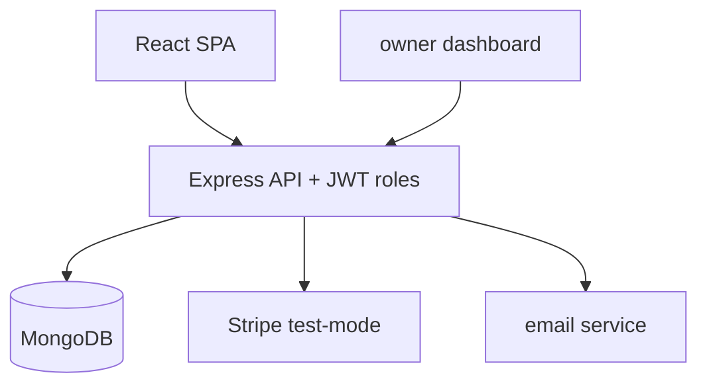

# AgendaFlow — Multi-tenant Scheduling SaaS


A production-shaped scheduling SaaS: **multi-tenant** (organizations → professionals →
availability), JWT + roles (owner/staff/client), freemium plan gating, owner analytics
dashboard and transactional e-mails.

> 🇧🇷 Um SaaS de agendamentos com cara de produção: **multi-tenant** (organização →
> profissionais → horários), JWT + papéis (dono/equipe/cliente), planos free/pro,
> dashboard de analytics para o dono e e-mails transacionais.

## Why this project matters

Multi-tenancy, roles and plan-gating are the vocabulary of real SaaS engineering —
the #1 thing technical recruiters probe ("have you built software as a *product*?").
AgendaFlow grows out of two working projects of mine
([Marcacao_Horario](https://github.com/FrancosCorporation/Marcacao_Horario) front +
[back-end](https://github.com/FrancosCorporation/Marcacao_Horario_Back-End), Node/Mongo, boot-tested)
upgraded to the patterns of the best open-source SaaS boilerplates.

## Features (roadmap)

- [ ] **M1** — Multi-tenant model, JWT + roles, availability calendar, booking flow
- [ ] **M2** — Freemium gate (free/pro features), Stripe test-mode checkout, owner dashboard
- [ ] **M3** — Analytics (bookings/week, no-show), public documented API, e2e tests

## Architecture



## Quick start (planned)

```bash
docker compose up   # app + mongo
```

## Built with

- [wasp-lang/open-saas](https://github.com/wasp-lang/open-saas) (MIT, 16k⭐) — SaaS
  patterns: org/user/plan entities, admin dashboard, Stripe test flow
- My boot-tested foundations: Marcacao_Horario (front + back), api_authentication,
  api_nest_run_container (JWT patterns)

## License

MIT — Rodolfo Franco ([FrancosCorporation](https://github.com/FrancosCorporation))

---

### 🇧🇷 Sobre (PT-BR)

SaaS de agendamentos multi-tenant evoluído dos meus projetos Marcacao_Horario
(front+back, boot testado) para os padrões do open-saas (MIT): roles, planos,
Stripe test-mode, dashboard do dono e analytics. Roadmap de 3 milestones no
PROJETOS_RH.md do workspace.
